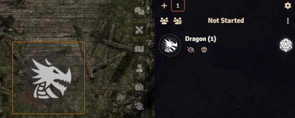

# Manual Initiative

A tiny module for Foundry VTT which allows you to enter initiative values in the combat tracker without having roll in-program first.

## About

For those of us using Foundry VTT for in-person games, who roll actual dice, it can be annoying to have to roll initiative in the combat tracker before you can put the actual numbers in - especially when you are mid-combat and new combatants get mixed into the pool and lost.

This module automatically sets all new combatants to an intiative of -1 when they are added to the combat tracker.

You can then find the combatant and enter their initiative right away!

### Before



1. Add a creature to the combat
2. Press the dice button
3. Wait for the roll
    * The creature will get a random number and get mixed into the active pool
4. Ignore the dice-rolling sound effect
    * This is multilplied by however many creatures you are adding, which can be amusing for the players when they hear a randomly large number of dice rolling sounds
5. Find the creature in the pool
    * Especially fun when you have several creatures of the same type with similar initiatives
6. Set the actual number you rolled in person

### After


1. Add a creature to the combat
2. Find the creature in the pool
    * Even when you have many creatures, you always know when you haven't set it since it will be -1
3. Set the number you rolled in person

## Installation

Either search for and install this module within Foundry VTT, or copy this address into the `Manifest URL` bar:

```
https://raw.githubusercontent.com/AnthonyEdmonds/manual-initiative/main/module.json
```

## Issues

If you encounter any problems, raise a ticket on Github and I'll take a look.
